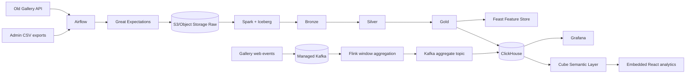

# Архитектура решения

## Ключевые решения

- Object Storage используется как S3-compatible Data Lake.
- Kafka отделяет генерацию событий сайта от real-time обработки.
- Airflow отвечает за batch orchestration, retry и алерты.
- Great Expectations задаёт контракты качества для Raw слоя.
- Iceberg обеспечивает ACID-таблицы Bronze/Silver/Gold поверх S3.
- Feast регистрирует Gold-признаки для ML-сценариев.
- Cube отделяет бизнес-метрики от физических таблиц ClickHouse.
